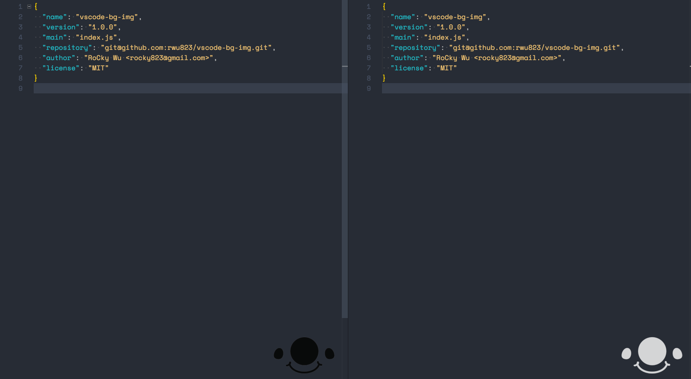

# vscode-bg-img
VSCode background images set.

## Setups
Install VSCode extension [background](https://marketplace.visualstudio.com/items?itemName=shalldie.background)

## Settings

Add in your `settings.json`.

```json
"background.useDefault": false,
"background.customImages": [
    "https://raw.githubusercontent.com/rwu823/vscode-bg-img/master/images/17/baby-black.png",
    "https://raw.githubusercontent.com/rwu823/vscode-bg-img/master/images/17/baby-white.png",
    "/your/patch/image"
],
"background.style": {
    "background-position": "95% 95%",
    "background-size": "20%",
    "opacity": 0.8
}
```

## Screenshots

### 17 baby white and black

